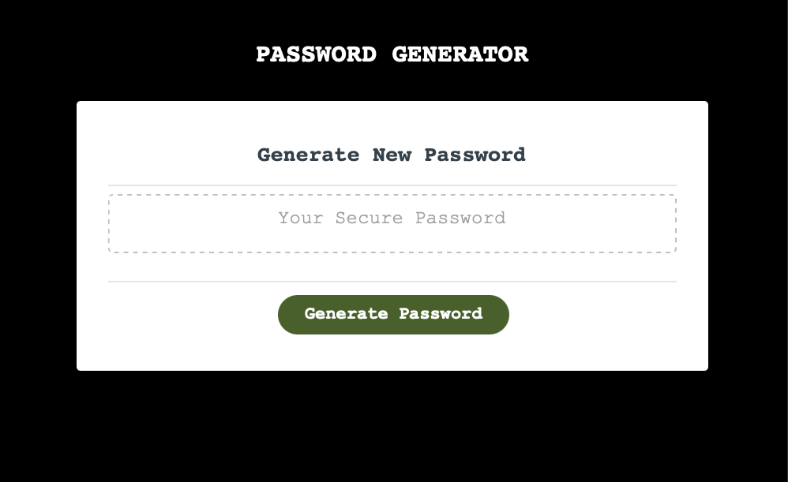
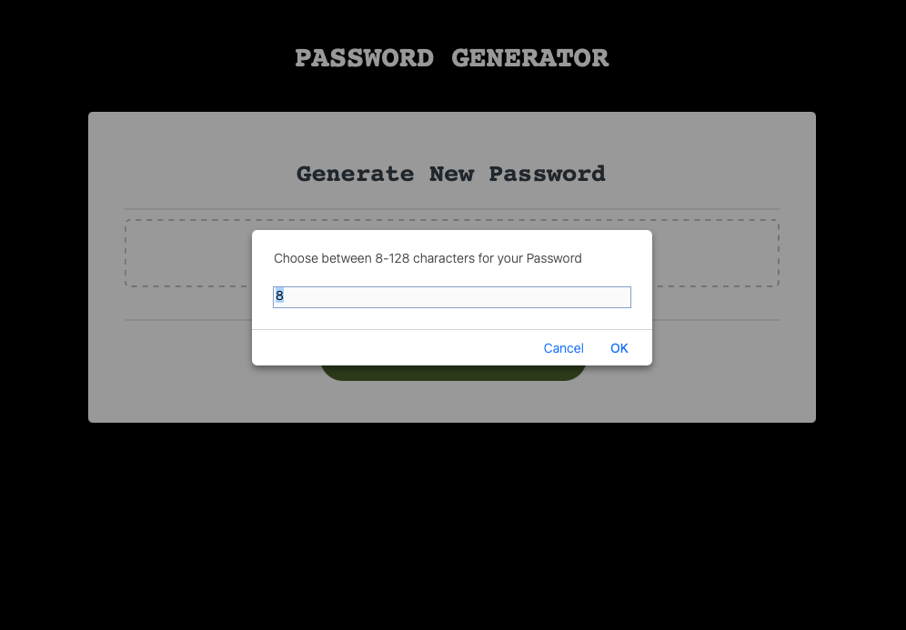
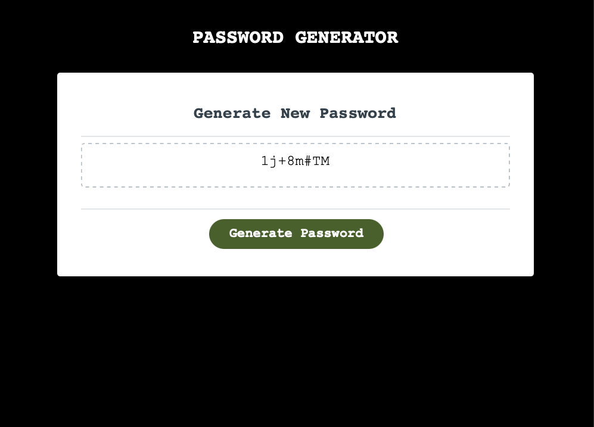

# PasswordGenerator

Password Generator Project

- This Password Generator Project was done based on a starter code which was included in the first commit. 
- This Generator allows the individual to generate a random password based on the prompts.
- When asked to Generete Password, we are prompted to type a length of desired password (8-128 Characters)
- We are also prompted to pick what type of characters should be included (Uppercase, Lowercase, Special Characters, Numbers)
- Once prompt choices are made, generator will produce a secure password in box.

# Skills Used

- Javascript
- CSS
- HTML

# Images

# Link
https://madavila5.github.io/PasswordGen/ 